<!-- ========================================================= -->
<!--                 ANTON KARAS — PORTFOLIO                     -->
<!-- ========================================================= -->

# My Portfolio

*Welcome to my portfolio.*
*I build **scalable web applications, robust backend systems, blockchain solutions, and AI-powered software** with a focus on clean architecture, performance, security, and modern user experiences.*

Specialized in **full-stack development**, **real-time systems**, **healthcare & booking platforms**, **DeFi/trading interfaces**, and **AI-powered products** — from product design through production deployment.

  

<em>Click any project cover to open its slideshow in the interactive gallery.</em>

## Featured Projects

<table>
<tr>

<!-- PROJECT 1 -->
<td width="50%" valign="top">

<h3 align="center">01. QloApps</h3>

  <a href="https://antonkarasbiz.github.io/portfolio/#qloapps">
    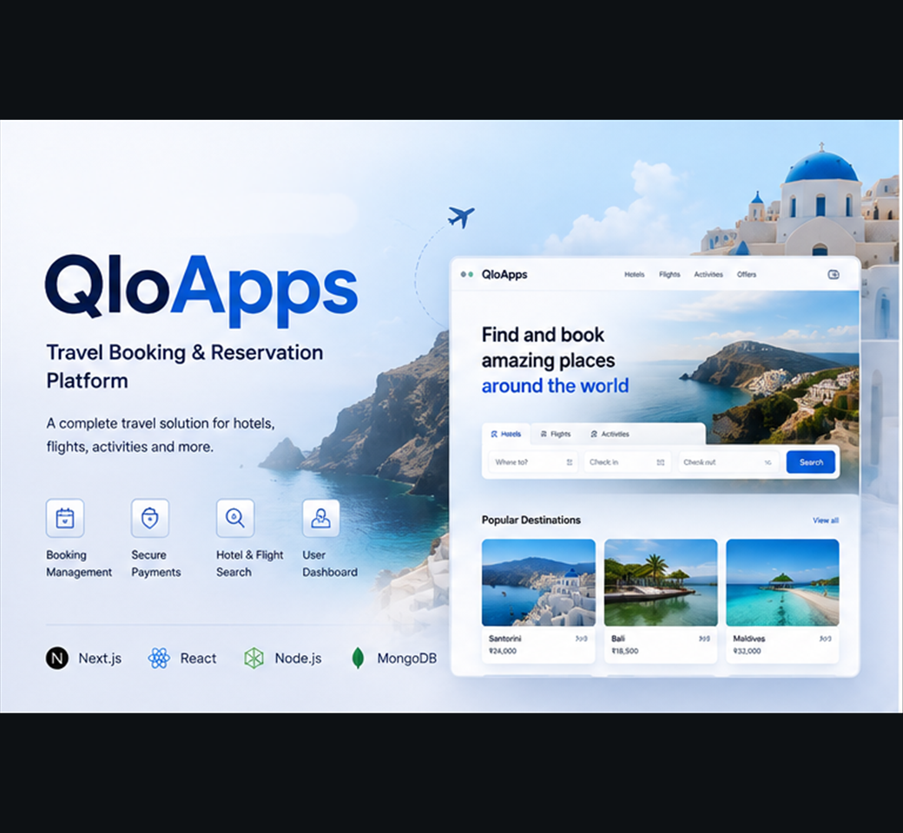
  </a>

Open-source hotel-management and reservation platform covering PMS, online booking, hotel websites, and channel management. Supports hotel operations such as reservations, room inventory, front-desk management, revenue management, POS, and reporting.

<strong>Portfolio category:</strong> Full-Stack Web Application / Booking &amp; Reservation

  <code>PHP</code> <code>MySQL</code> <code>PMS</code> <code>Online Booking</code> <code>Channel Management</code> <code>Payment Integration</code>

<a href="https://qloapps.com/">🔗 <strong>VIEW LIVE PROJECT</strong></a>

</td>

<!-- PROJECT 2 -->
<td width="50%" valign="top">

<h3 align="center">02. LittleAIBox</h3>

  <a href="https://antonkarasbiz.github.io/portfolio/#littleaibox">
    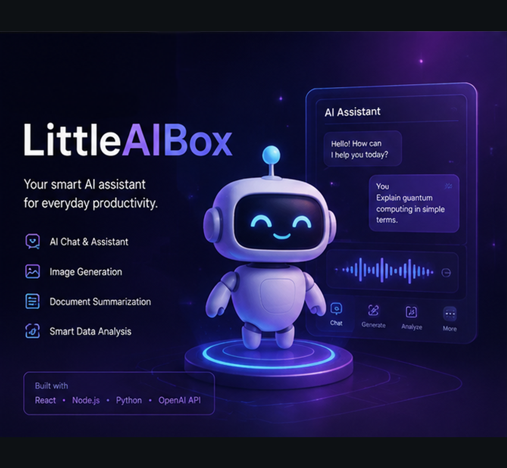
  </a>

Privacy-focused AI chat platform providing AI-assisted conversations, coding, writing, translation, and research tools. Includes task presets, customizable AI parameters, conversation management, API-key configuration, and subscription features.

<strong>Portfolio category:</strong> AI-Powered Application

  <code>React</code> <code>TypeScript</code> <code>LLM Integration</code> <code>Conversational AI</code> <code>API Configuration</code>

<a href="https://littleaibox.com/">🔗 <strong>VIEW LIVE PROJECT</strong></a>

</td>

</tr>
<tr>

<!-- PROJECT 3 -->
<td width="50%" valign="top">

<h3 align="center">03. Paradex</h3>

  <a href="https://antonkarasbiz.github.io/portfolio/#paradex">
    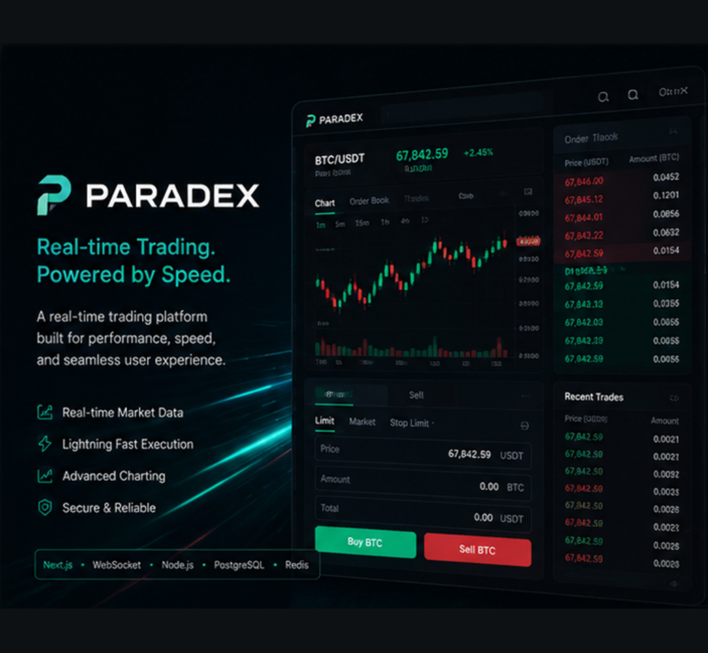
  </a>

Decentralized trading platform combining blockchain technology with a high-performance exchange experience. Supports perpetual futures, options, spot trading, unified margin, real-time markets, and REST/WebSocket APIs.

<strong>Portfolio category:</strong> Blockchain/Web3 / Real-Time Web Application <em>Trading application: Paradex Trading App</em>

  <code>React</code> <code>TypeScript</code> <code>WebSocket</code> <code>Perpetual Futures</code> <code>Smart Contracts</code>

<a href="https://www.paradex.trade/">🔗 <strong>VIEW LIVE PROJECT</strong></a>

</td>

<!-- PROJECT 4 -->
<td width="50%" valign="top">

<h3 align="center">04. DentalPin</h3>

  <a href="https://antonkarasbiz.github.io/portfolio/#dentalpin">
    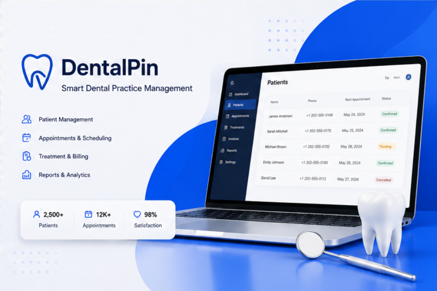
  </a>

Dental-clinic management application designed to manage patients, appointments, budgets, payments, and day-to-day clinic operations. Provides an integrated business dashboard for organizing clinical records, scheduling, financial information, and practice workflows.

<strong>Portfolio category:</strong> Healthcare Management / Database &amp; API Integration

  <code>React</code> <code>TypeScript</code> <code>Node.js</code> <code>PostgreSQL</code> <code>Patient Management</code> <code>API Integration</code>

<a href="https://demo.dentalpin.com/login">🔗 <strong>VIEW LIVE PROJECT</strong></a>

</td>

</tr>
<tr>

<!-- PROJECT 5 -->
<td width="50%" valign="top">

<h3 align="center">05. V7 Labs</h3>

  

AI platform for document processing, computer vision, medical AI, and intelligent data extraction. Provides automated workflows for turning complex visual and unstructured data into usable information.

<strong>Portfolio category:</strong> AI Platform / Computer Vision &amp; Data Extraction

  <code>Computer Vision</code> <code>Document Processing</code> <code>Medical AI</code> <code>Data Extraction</code>

<a href="https://www.v7labs.com/">🔗 <strong>VIEW LIVE PROJECT</strong></a>

</td>

<!-- PROJECT 6 -->
<td width="50%" valign="top">

<h3 align="center">06. folk</h3>

  <a href="https://antonkarasbiz.github.io/portfolio/#folk">
    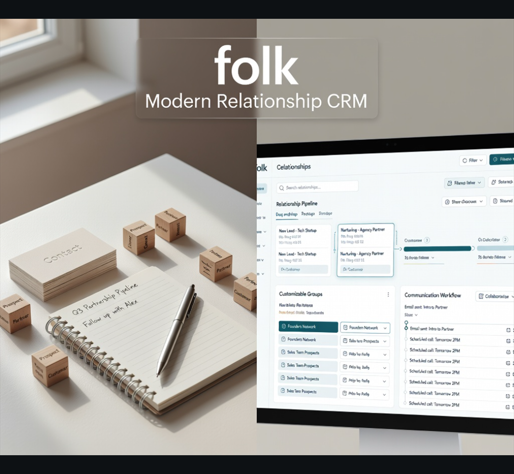
  </a>

Relationship-focused CRM designed for founders, agencies, sales teams, and growing businesses. Combines contact management, relationship tracking, pipelines, communication, and customizable workflows.

<strong>Portfolio category:</strong> CRM / Relationship Management SaaS

  <code>CRM</code> <code>Contact Management</code> <code>Sales Pipelines</code> <code>Workflow Automation</code>

<a href="https://www.folk.app/">🔗 <strong>VIEW LIVE PROJECT</strong></a>

</td>

</tr>
<tr>

<!-- PROJECT 7 -->
<td width="50%" valign="top">

<h3 align="center">07. Whatnot</h3>

  <a href="https://antonkarasbiz.github.io/portfolio/#whatnot">
    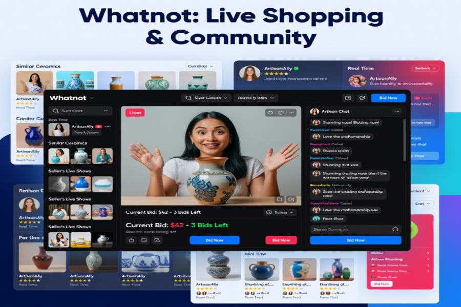
  </a>

Live-shopping marketplace where sellers showcase products through interactive livestreams. Combines e-commerce, live video, auctions, community interaction, and social product discovery.

<strong>Portfolio category:</strong> E-Commerce / Live Streaming Marketplace

  <code>E-Commerce</code> <code>Live Streaming</code> <code>Marketplace</code> <code>Social Commerce</code>

<a href="https://www.whatnot.com/">🔗 <strong>VIEW LIVE PROJECT</strong></a>

</td>

<!-- PROJECT 8 -->
<td width="50%" valign="top">

<h3 align="center">08. Tebra</h3>

  <a href="https://antonkarasbiz.github.io/portfolio/#tebra">
    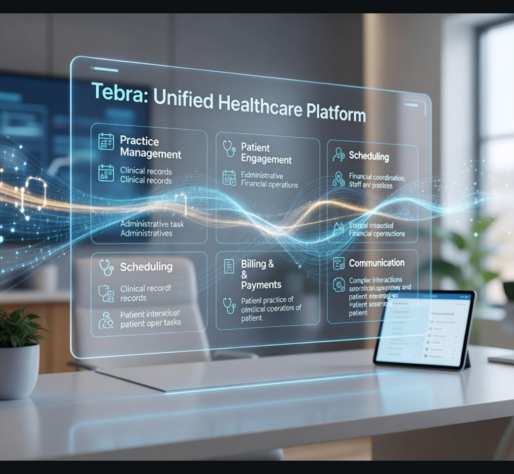
  </a>

Healthcare practice-management platform for medical practices and healthcare providers. Supports patient management, scheduling, billing, payments, communication, and other clinical business workflows.

<strong>Portfolio category:</strong> Healthcare Management / Practice Management

  <code>Healthcare Management</code> <code>Practice Management</code> <code>Billing &amp; Payments</code> <code>Clinical Workflows</code>

<a href="https://www.tebra.com/">🔗 <strong>VIEW LIVE PROJECT</strong></a>

</td>

</tr>
<tr>

<!-- PROJECT 9 -->
<td width="50%" valign="top">

<h3 align="center">09. Fibery</h3>

  <a href="https://antonkarasbiz.github.io/portfolio/#fibery">
    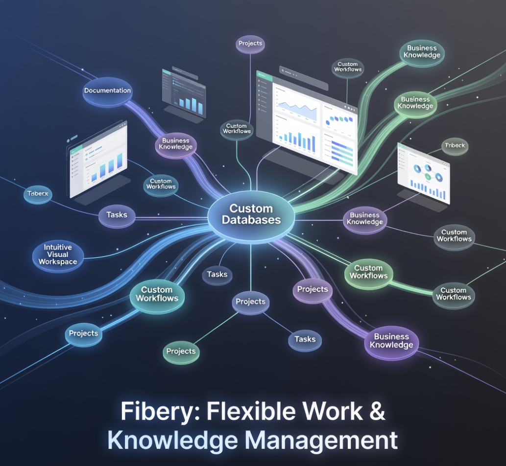
  </a>

Flexible work management platform for product and startup teams. Combines docs, tasks, databases, and workflows in a connected workspace for planning, knowledge sharing, and cross-team collaboration.

<strong>Portfolio category:</strong> SaaS / Work Management Platform

  <code>Work Management</code> <code>Knowledge Base</code> <code>Workflow Automation</code> <code>Team Collaboration</code>

<a href="https://fibery.io/">🔗 <strong>VIEW LIVE PROJECT</strong></a>

</td>

<!-- PROJECT 10 -->
<td width="50%" valign="top">

<h3 align="center">10. Mercury</h3>

  <a href="https://antonkarasbiz.github.io/portfolio/#mercury">
    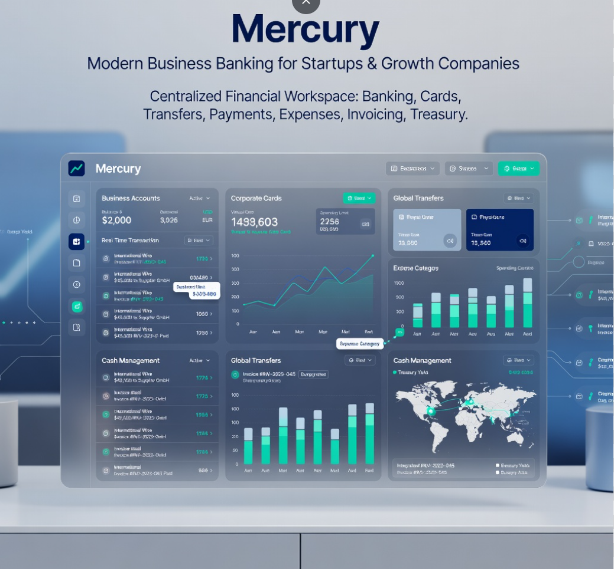
  </a>

Modern banking platform built for startups and growing businesses. Provides business accounts, treasury tools, payments, invoicing, and financial workflows designed for fast-moving teams.

<strong>Portfolio category:</strong> FinTech / Banking &amp; Payments Platform

  <code>FinTech</code> <code>Banking</code> <code>Payments</code> <code>Invoicing</code> <code>Financial Dashboard</code>

<a href="https://mercury.com/">🔗 <strong>VIEW LIVE PROJECT</strong></a>

</td>

</tr>
<tr>

<!-- PROJECT 11 -->
<td width="50%" valign="top">

<h3 align="center">11. Nuclino</h3>

  <a href="https://antonkarasbiz.github.io/portfolio/#nuclino">
    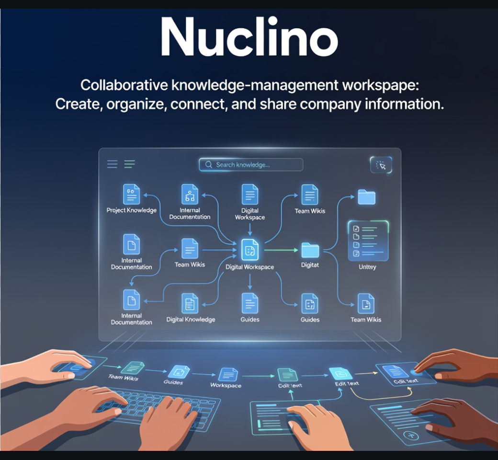
  </a>

Collaborative wiki and knowledge base for teams. Enables structured documentation, real-time editing, internal knowledge sharing, and lightweight project organization in one unified workspace.

<strong>Portfolio category:</strong> SaaS / Knowledge Management

  <code>Knowledge Base</code> <code>Team Wiki</code> <code>Real-Time Collaboration</code> <code>Documentation</code>

<a href="https://www.nuclino.com/">🔗 <strong>VIEW LIVE PROJECT</strong></a>

</td>

<!-- PROJECT 12 -->
<td width="50%" valign="top">

<h3 align="center">12. PostHog</h3>

  <a href="https://antonkarasbiz.github.io/portfolio/#posthog">
    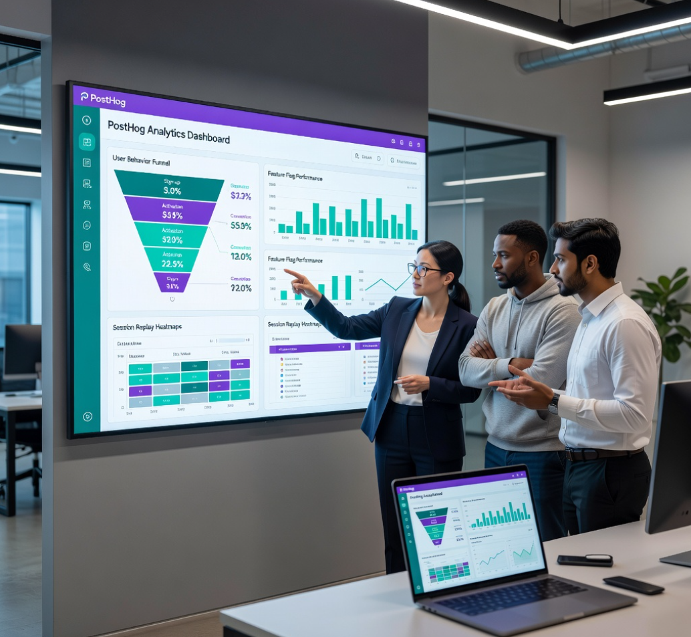
  </a>

Open-source product analytics platform for engineering and product teams. Combines event tracking, funnels, session replay, feature flags, A/B testing, and product insights in one integrated stack.

<strong>Portfolio category:</strong> Analytics / Product Intelligence Platform

  <code>Product Analytics</code> <code>Session Replay</code> <code>Feature Flags</code> <code>A/B Testing</code>

<a href="https://posthog.com/">🔗 <strong>VIEW LIVE PROJECT</strong></a>

</td>

</tr>
<tr>

<!-- PROJECT 13 -->
<td width="50%" valign="top">

<h3 align="center">13. SavvyCal</h3>

  <a href="https://antonkarasbiz.github.io/portfolio/#savvycal">
    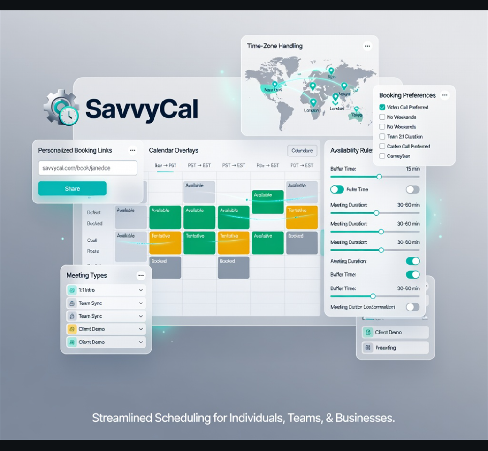
  </a>

Scheduling and calendar coordination platform designed for teams and professionals. Simplifies meeting booking, availability sharing, timezone handling, and polished scheduling workflows.

<strong>Portfolio category:</strong> SaaS / Scheduling &amp; Calendar Platform

  <code>Scheduling</code> <code>Calendar Integration</code> <code>Availability Management</code> <code>Meeting Workflows</code>

<a href="https://savvycal.com/">🔗 <strong>VIEW LIVE PROJECT</strong></a>

</td>

<!-- PROJECT 14 -->
<td width="50%" valign="top">

<h3 align="center">14. Zerion</h3>

  <a href="https://antonkarasbiz.github.io/portfolio/#zerion">
    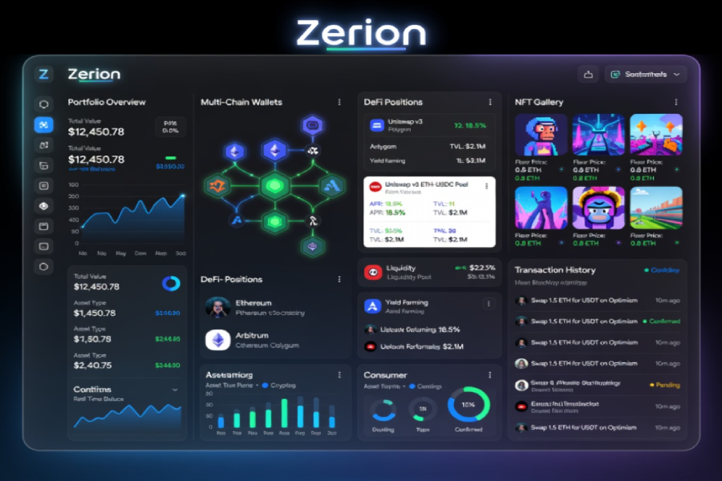
  </a>

Web3 wallet and DeFi portfolio management platform. Provides a unified interface for tracking crypto assets, managing wallets, exploring DeFi positions, and interacting with blockchain applications.

<strong>Portfolio category:</strong> Blockchain/Web3 / Wallet &amp; DeFi Platform

  <code>Web3</code> <code>DeFi</code> <code>Crypto Wallet</code> <code>Portfolio Tracking</code> <code>Blockchain Integration</code>

<a href="https://zerion.io/">🔗 <strong>VIEW LIVE PROJECT</strong></a>

</td>

</tr>
</table>

  <a href="https://github.com/antonkarasbiz/antonkarasbiz">
    ← Back to Profile
  </a>

